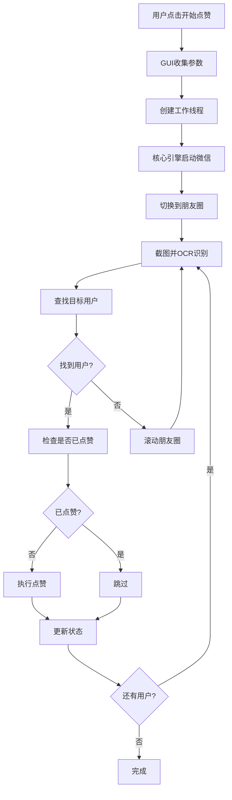
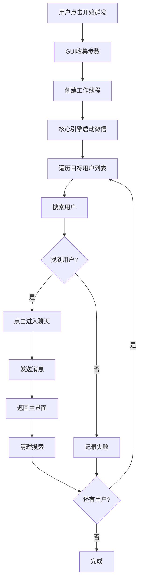

# 项目架构说明 (Project Architecture)

本文档详细说明了微信自动化工具的代码架构和模块组织。

## 📋 总体架构

项目采用模块化设计，主要分为以下几个层次：

```
┌─────────────────────────────────────┐
│           GUI 用户界面层              │
│        (wechat_automation_gui.py)   │
├─────────────────────────────────────┤
│           核心业务逻辑层              │
│        (wechat_core_engine.py)      │
├─────────────────────────────────────┤
│           工具服务层                 │
│  ┌─────────────┬─────────────────┐   │
│  │ OCR识别引擎  │   微信启动器     │   │
│  │(rapid_ocr)  │ (wechat_launcher)│   │
│  └─────────────┴─────────────────┘   │
├─────────────────────────────────────┤
│           系统接口层                 │
│    (PyAutoGUI, PyQt5, Win32API)    │
└─────────────────────────────────────┘
```

## 🗂️ 核心模块详解

### 1. GUI 用户界面层

**文件**: `wechat_automation_gui.py`

**职责**:
- 提供用户交互界面
- 管理用户输入和配置
- 显示操作状态和日志
- 协调各个功能模块

**主要类**:
- `WeChatAutomationGUI`: 主窗口类
- `WorkerThread`: 后台工作线程

**关键功能**:
```python
# 主要方法
- setup_ui()           # 界面初始化
- start_liking()       # 启动点赞功能
- start_mass_sending() # 启动群发功能
- update_status()      # 更新状态显示
- load_config()        # 加载配置
- save_config()        # 保存配置
```

### 2. 核心业务逻辑层

**文件**: `wechat_core_engine.py`

**职责**:
- 实现所有自动化操作逻辑
- 处理微信界面交互
- 管理操作流程和状态

**主要类**:
- `WeChatCoreEngine`: 核心引擎类

**关键功能模块**:

#### 朋友圈点赞模块
```python
# 主要方法
- like_moments()              # 朋友圈点赞主流程
- scroll_and_find_user()      # 滚动查找用户
- click_like_if_not_liked()   # 点赞操作
- check_if_already_liked()    # 检查是否已点赞
```

#### 群发消息模块
```python
# 主要方法
- mass_send_messages()        # 群发消息主流程
- search_and_send_to_user()   # 搜索并发送给用户
- send_message()              # 发送消息
- clear_search_and_return()   # 清理搜索并返回
```

#### 微信界面操作模块
```python
# 主要方法
- launch_wechat()             # 启动微信
- switch_to_moments()         # 切换到朋友圈
- take_screenshot()           # 截图
- find_element_by_ocr()       # OCR查找元素
```

### 3. 工具服务层

#### OCR 识别引擎

**文件**: `rapid_ocr_engine.py`

**职责**:
- 提供文字识别服务
- 处理图像预处理
- 优化识别精度

**主要类**:
- `RapidOCREngine`: OCR引擎封装类

**关键功能**:
```python
# 主要方法
- ocr()                       # 执行OCR识别
- preprocess_image()          # 图像预处理
- find_text_location()        # 查找文字位置
```

#### 微信启动器

**文件**: `wechat_launcher.py`

**职责**:
- 智能检测微信安装路径
- 管理微信进程
- 提供路径缓存机制

**主要类**:
- `WeChatLauncher`: 微信启动器类

**路径检测策略**:
```python
# 检测顺序
1. 配置文件路径
2. 常见安装路径
3. 注册表查询
4. 运行进程检测
5. 全盘搜索
6. 用户手动选择
```

## 🔄 数据流向

### 朋友圈点赞流程



### 群发消息流程



## 🔧 配置管理

### 配置文件结构

**文件**: `wechat_config.json`

```json
{
    "wechat_path": "微信安装路径",
    "last_targets": "上次使用的目标用户",
    "wait_time": "等待时间设置",
    "scroll_settings": {
        "scroll_distance": "滚动距离",
        "scroll_pause": "滚动间隔"
    }
}
```

### 配置加载优先级

1. 用户界面输入
2. 配置文件设置
3. 程序默认值

## 🧵 多线程设计

### 线程模型

```
主线程 (GUI)
├── 界面渲染
├── 用户交互处理
└── 状态更新

工作线程 (Worker)
├── 自动化操作执行
├── 微信界面交互
└── 进度反馈
```

### 线程通信

- 使用 PyQt5 的信号槽机制
- 主要信号:
  - `progress_updated`: 进度更新
  - `status_updated`: 状态更新
  - `operation_completed`: 操作完成
  - `error_occurred`: 错误发生

## 🛡️ 错误处理策略

### 异常分类

1. **系统级异常**
   - 微信未安装
   - 权限不足
   - 系统资源不足

2. **操作级异常**
   - 界面元素未找到
   - OCR识别失败
   - 网络连接问题

3. **用户级异常**
   - 输入参数错误
   - 目标用户不存在
   - 操作被用户中断

### 处理机制

```python
# 异常处理模式
try:
    # 执行操作
    result = perform_operation()
except SpecificException as e:
    # 特定异常处理
    handle_specific_error(e)
except Exception as e:
    # 通用异常处理
    log_error(e)
    show_user_friendly_message()
finally:
    # 清理资源
    cleanup_resources()
```

## 📈 性能优化

### 优化策略

1. **图像处理优化**
   - 截图区域限制
   - 图像压缩
   - 缓存机制

2. **OCR识别优化**
   - 预处理优化
   - 识别区域限制
   - 结果缓存

3. **界面响应优化**
   - 异步操作
   - 进度反馈
   - 操作队列

## 🔮 扩展性设计

### 插件化架构

项目设计支持功能模块的插件化扩展：

```python
# 功能模块接口
class AutomationModule:
    def execute(self, params):
        pass
    
    def get_name(self):
        pass
    
    def get_description(self):
        pass
```

### 新功能添加指南

1. 在 `wechat_core_engine.py` 中添加核心逻辑
2. 在 `wechat_automation_gui.py` 中添加界面元素
3. 更新配置文件结构
4. 添加相应的测试用例

---

本架构文档会随着项目的发展持续更新，如有疑问请参考代码注释或提交 Issue。